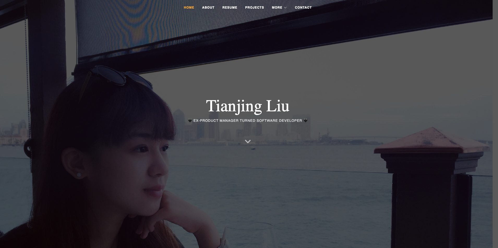

### My Personal Homepage

#### https://jjjing2023.github.io/

### Author: Tianjing Li

Design Doc: https://rv1aomcbum.feishu.cn/docx/WoBedxQuSoycXwxBycJcfba8n6c
Presentation Slides:
Video:
Wireframe: https://www.figma.com/file/W8ba00KYEv8jlXDtSeGauS/personal-homepage?type=whiteboard&node-id=0%3A1&t=H2eQyKaOSYo8Mt6g-1
Release: [Homepage](https://jjjing2023.github.io/)
A project from CS 5610 Web Development: [Class Link](https://johnguerra.co/classes/webDevelopment_fall_2023/)

### Preview:

### Features:

[Video](https://youtu.be/1_u326Us-mQ)  
[Slides](https://docs.google.com/presentation/d/1y0k3IhyBkj_wqHyUUwIzrWmgDCD7URtaz3tN7w1Sja8/edit#slide=id.p1)

### Technologies:

### Intro to Install/ Run:

1. Access it directly by the link [Homepage](https://jjjing2023.github.io/).
2. Clone the repository and run it locally either on your local server, or through a browser.

- Enter your local directory of the code in the CLI terminal.
- Start a local server in CLI (e.g. reload -b )
- Enter the URL of the index page in the browser.
- Done!

### Copyright:

The website is hosted using GitHub Pages and can be accessed here(https://jjjing2023.github.io/).

### Copyright:

This webpage takes advantage of templates from bootstrap. This project is under MIT license. All modified image resources could be distributed with same methods. Photos of myself will be shared with CC 4.0 BY-NC-ND license.
